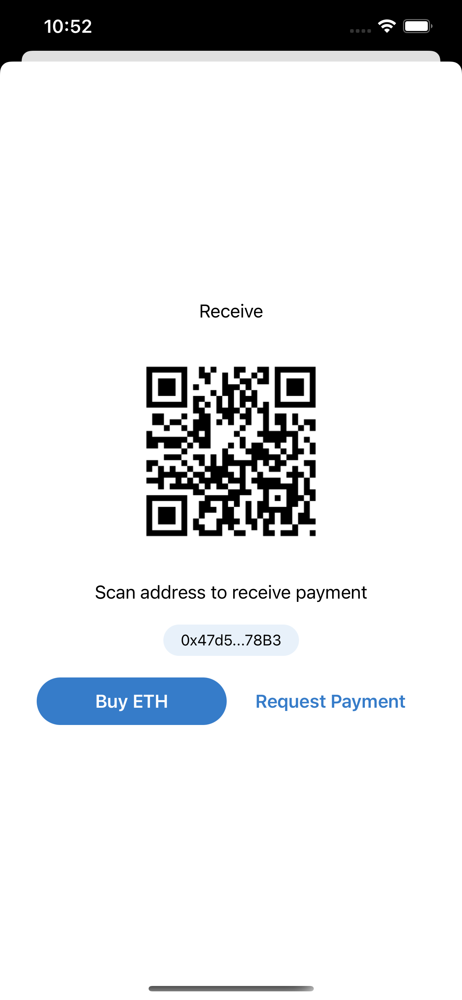
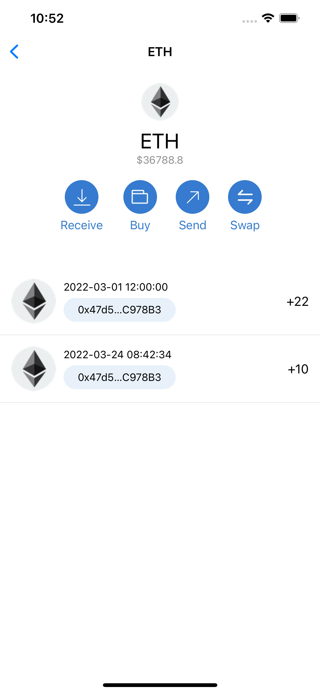

# MetaMaskDemo
This is an iOS App in metamask style. It is code by Swift UI, load mock data from api server.
It support at lease 3 type iPhone, iPhone 13 pro max, iPhone 13, iPhone 8

### Requirement

### Project Struct

#### Classes

- Global
	- MetaMaskDemoApp (App Entry)
	- MetaMaskDemoConfig (App Config)
- Model
	- MetaMaskDemoTabItem (TabItem used on home screen tab view)
	- MetaMaskDemoMenuItem (MenuItem used on home screen menu buttons)
	- MetaMaskDemoAccountInfo (Account Info Model, the main data model display on the home screen, contains id, user_name, balance, etc)
	- MetaMaskDemoTokenInfo (Token Info Model, it is contained by Account Info Model, shows token's id, name, amount, balance, etc)
	- MetaMaskDemoTokenDetailInfo (Token Detail Info Model, the main data model display on the token detail view, contains id, name, balance, transactions, etc)
	- MetaMaskDemoTransactionInfo (Transactio Model, it is contained by Token Detail Info Model, shows id, timestamp, amount, address)
- View
	- MetaMaskDemoHomeView (Home Screen View)
	- MetaMaskDemoNFTView (NFT View)
	- MetaMaskDemoTokenView (It is contained by Home Screen View, shows token's info)
	- MetaMaskDemoReceiveView (Shows when users click receive button, contains qrcode, address, etc)
	- MetaMaskDemoTokenDetailView (Shows when users click token detail, shows detail about token, such as transactions, name, etc)
- Manager
	- MetaMaskDemoNetworkManager (Manage all the network request about mock data)
- Resource
	- Assets
	- Launch Screen

### Functions
This app has three more more pages.

* Home Page

* Receive Token Page

* Token detail Page

### Mock Data

### Test Cases
