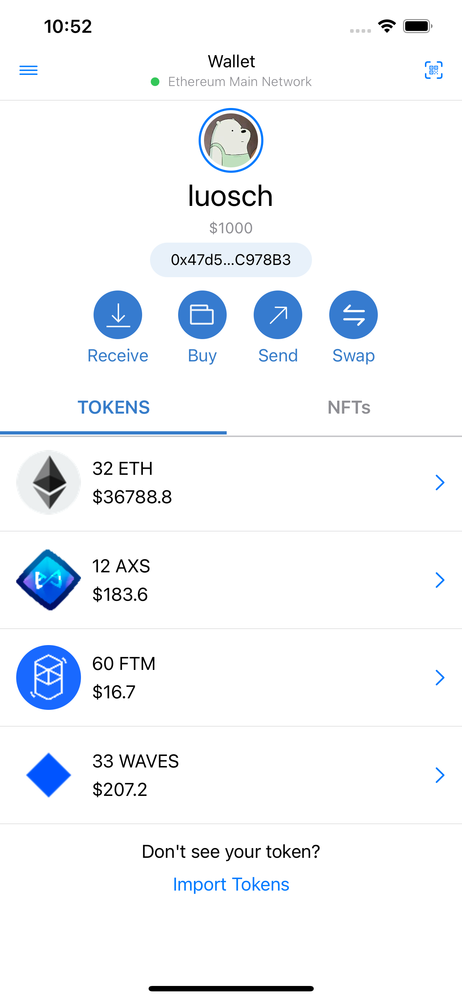

# MetaMaskDemo
This is an iOS App in metamask style. It is code by Swift UI, load mock data from api server.
It support at lease 3 type iPhone, iPhone 13 pro max, iPhone 13, iPhone 8

### Requirement

### Project Struct

- Global
	- MetaMaskDemoApp (App Entry)
	- MetaMaskDemoConfig (App Config)
- Model
	- MetaMaskDemoTabItem (TabItem used on home screen tab view)
	- MetaMaskDemoMenuItem (MenuItem used on home screen menu buttons)
	- MetaMaskDemoAccountInfo (Account Info Model, the main data model display on the home screen, contains id, user_name, balance, etc)
	- MetaMaskDemoTokenInfo (Token Info Model, it is contained by Account Info Model, shows token's id, name, amount, balance, etc)
	- MetaMaskDemoTokenDetailInfo (Token Detail Info Model, the main data model display on the token detail view, contains id, name, balance, transactions, etc)
	- MetaMaskDemoTransactionInfo (Transactio Model, it is contained by Token Detail Info Model, shows id, timestamp, amount, address)
- View
	- MetaMaskDemoHomeView (Home Screen View)
	- MetaMaskDemoNFTView (NFT View)
	- MetaMaskDemoTokenView (It is contained by Home Screen View, shows token's info)
	- MetaMaskDemoReceiveView (Shows when users click receive button, contains qrcode, address, etc)
	- MetaMaskDemoTokenDetailView (Shows when users click token detail, shows detail about token, such as transactions, name, etc)
- Manager
	- MetaMaskDemoNetworkManager (Manage all the network request about mock data)
- Resource
	- Assets
	- Launch Screen

### Functions
This app has three more more pages.

* Home Page


* Receive Token Page


* Token detail Page


### Mock Data
This app loads data from mock server, it has two api to load data.

1. Account Info
https://chinaeasy.net/api/account_info.json
```
{
	"id": "0x47d5c76e3c7299fd6628203Ca059CaeFc0C978B3",
	"user_name": "luosch",
	"avatar_url": "https://chinaeasy.net/api/6956493.jpeg",
	"balance": "$1000",

	"tokens": [
		{
			"id": "1005",
			"icon_url": "https://chinaeasy.net/api/1027.png",
			"name": "ETH",
			"amount": "32",
			"balance": "$36788.8",
		},
		{
			"id": "1006",
			"icon_url": "https://chinaeasy.net/api/6783.png",
			"name": "AXS",
			"amount": "12",
			"balance": "$183.6",
		},
		{
			"id": "1007",
			"icon_url": "https://chinaeasy.net/api/3513.png",
			"name": "FTM",
			"amount": "60",
			"balance": "$16.7",
		},
		{
			"id": "1008",
			"icon_url": "https://chinaeasy.net/api/1274.png",
			"name": "WAVES",
			"amount": "33",
			"balance": "$207.2",
		}
	]
}
```

2. Token Detail
https://chinaeasy.net/api/account_${tokenID}.json
```
{
	"id": "1005",
	"icon_url": "https://chinaeasy.net/api/1027.png",
	"name": "ETH",
	"amount": "32",
	"balance": "$36788.8",
	"transactions": [
		{
			"id": "12",
			"timestamp": 1646107200.0,
			"amount": "+22",
			"address": "0x47d5c76e3c7299fd6628203Ca059CaeFc0C978B3",
		},
		{
			"id": "11",
			"timestamp": 1648082554.0,
			"amount": "+10",
			"address": "0x47d5c76e3c7299fd6628203Ca059CaeFc0C978B3",
		}
	]
}
```

### Test Cases

* Test Case 1
Enter this app, after loading network data.

Expect1: user name is "luosch"

Expect2: balance is "$1000"

* Test Case 2
Enter this app, after loading network data, click ETH cell on th TOKENS list.

Expect1: Enter ETH Token detail view

Expect2: balance is "$36788.8"

Expect2: see two transactions

* Test Case 3
Enter this app, after loading network data, click Receive

Expect1: Enter Receive page

Expect2: See a qrcode

Expect3: See a address "0x47d5c76e3c7299fd6628203Ca059CaeFc0C978B3"
